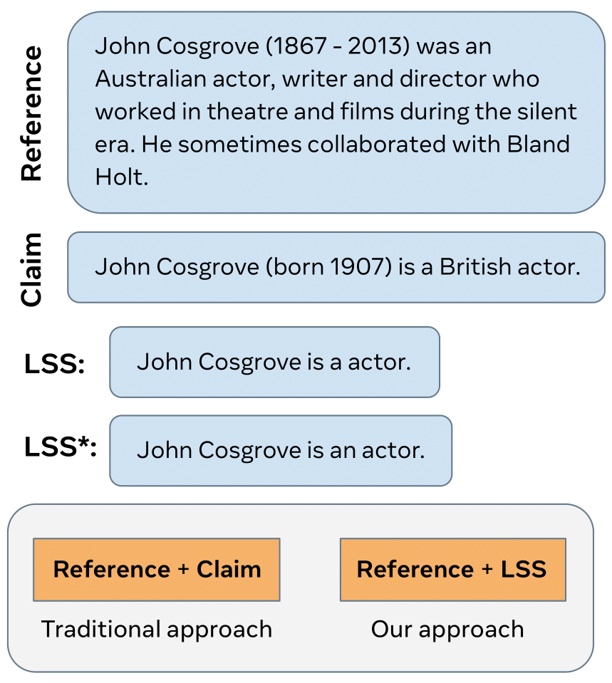

<!--  -->
<p align="center">

</p>


# Evaluation of Faithfulness Using the Longest Supported Subsequence. 

Please find the detailed work here: [paper](https://arxiv.org/abs/2308.12157)
```
@misc{mittal2023evaluation,
      title={Evaluation of Faithfulness Using the Longest Supported Subsequence}, 
      author={Anirudh Mittal and Timo Schick and Mikel Artetxe and Jane Dwivedi-Yu},
      year={2023},
      eprint={2308.12157},
      archivePrefix={arXiv},
      primaryClass={cs.CL}
}
```

## Data

The files used for Train and Test can be found in the Data folder. Description of the dataset can be found in the paper. 

## Model

The model checkpoints for the LSS and LSS* models can be downloaded using the following links: [LSS](https://dl.fbaipublicfiles.com/lss_eval/lss_archive.tar) [LSS star](https://dl.fbaipublicfiles.com/lss_eval/LSSstar.tar).


## Inference

Install the required librares using:
```
conda create -n lss_eval -y python=3.7 && conda activate lss_eval
pip install -e .
```

To get inference for a single input of reference-claim, use the the infer.py file. After downloading the models, change the path to model in the python file. Run the inference using
```
python infer.py $reference $claim
```

To evaluate results for an entire batch of reference and claim pair, use evaluate file. Replace the path to the model and CSV file in the python file. Then run,
```
python evaluate.py
```


## Licensing

See our LICENSE file for licensing details.

